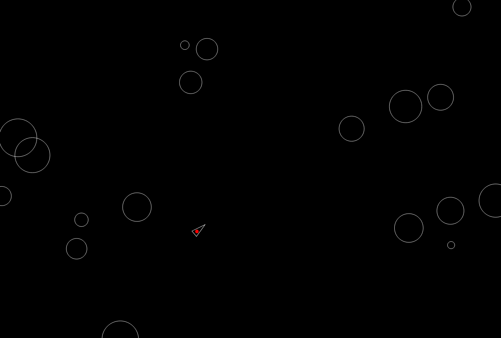

# Asteroids

## 💻 Project

Project developed based on the video playlist [Build Asteroids with JavaScript][playlist], created by [Net Ninja][channel].

## 🛠 Tech Stack

The following stack was used on the project development:

- Javascript

## 📷 Screenshots

<kbd>
  
</kbd>

[playlist]: https://www.youtube.com/playlist?list=PL4cUxeGkcC9iO8ai6LU0s6aHAaWP4RAkF
[channel]: https://www.youtube.com/@NetNinja

### Ideas for improvement

- Split or shrink big asteroids into small ones once they are hit
- Create a "Game Over" screen
- Create a "Start" screen
- Add different angles for asteroids entering on the screen
